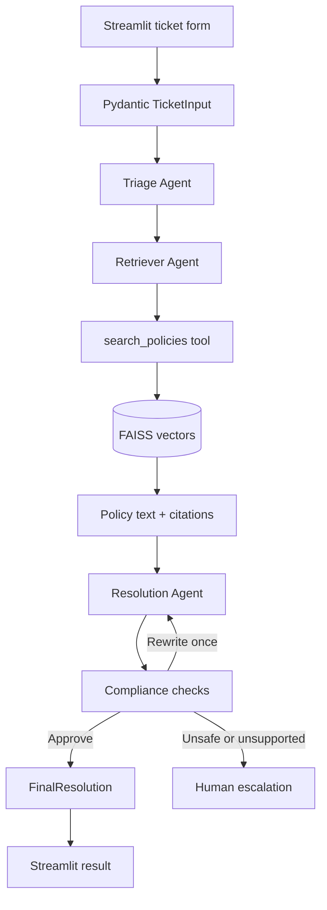

# ResolveAI

> An AI-assisted e-commerce support system that classifies customer tickets,
> retrieves relevant company policies from FAISS, writes a policy-grounded
> response, and validates the result before displaying it in Streamlit.

<p align="center">
  
  
</p>

<p align="center">
  
  
  
  
  
</p>

## Problem statement

Customer-support agents must read long policy documents before answering
refund, return, shipping, payment, warranty, fraud, cancellation and
marketplace questions. A normal LLM may answer fluently but invent a rule that
is not present in the company's policies.

ResolveAI uses Retrieval-Augmented Generation (RAG) to give the LLM relevant
policy sections before it writes the response. Each retrieved section carries
its original document and heading, allowing the final response to include
traceable citations.

## What the application does

1. Accepts a customer message and optional structured order information.
2. Classifies the issue and priority with a Triage Agent.
3. Lets the Retriever Agent create a focused policy-search query.
4. Executes the real `search_policies()` tool against a FAISS index.
5. Gives the retrieved text and citations to the Resolution Agent.
6. Audits the draft with deterministic citation validation and a Compliance
   Agent.
7. Returns a typed `FinalResolution` that the Streamlit UI displays.

The system supports Hinglish or English customer messages because the LLM
interprets the message before policy retrieval. Order context is optional, and
photo or video evidence is not required during initial ticket intake.

## Architecture



### Agents and tools are different

| Component | Type | Responsibility |
|---|---|---|
| Triage Agent | LLM call | Classifies the issue, priority, missing essential fields and escalation conditions |
| Retriever Agent | LLM call | Creates the semantic-search query and requests the FAISS tool |
| `search_policies()` | Python tool | Embeds the search query and searches FAISS |
| Resolution Agent | LLM call | Writes the customer response using retrieved evidence only |
| Compliance Agent | LLM call + Python check | Audits policy claims, citations and sensitive information |

## RAG pipeline

ResolveAI's RAG pipeline has two phases.

### 1. Index-building phase

```text
Markdown policy documents
        ↓
Split by headings
        ↓
Overlapping text chunks
        ↓
OpenAI embeddings
        ↓
L2-normalized vectors
        ↓
FAISS IndexFlatIP
        ↓
policies.index + policies.json
```

- `policies.index` stores the numerical FAISS vectors.
- `policies.json` stores readable policy text, source document, section and
  embedding-model metadata.
- The position of a vector matches the position of its readable metadata.
- If policy content or the embedding model changes, the index is rebuilt.

### 2. Ticket-resolution phase

```text
Customer ticket + optional order context
        ↓
Focused semantic-search query
        ↓
Query embedding
        ↓
Cosine-similarity search in FAISS
        ↓
Top policy chunks + exact citations
        ↓
Policy-grounded customer response
```

Stored vectors and the query vector are L2-normalized. Therefore, the inner
product used by `faiss.IndexFlatIP` acts as cosine similarity.

## Key features

- Native FAISS vector search with no external vector-database server.
- Thirteen Markdown policy documents covering major e-commerce support cases.
- Structured Pydantic inputs and LLM outputs.
- Exact source-and-section citations attached to retrieved evidence.
- Configurable minimum similarity threshold.
- One bounded compliance rewrite before human escalation.
- Clarification flow for genuinely essential missing information.
- Optional order context with UPI, card and cash-on-delivery support.
- INR/USD display selection in the Streamlit interface.
- Customer email excluded from LLM context because it is unnecessary PII.
- HTML escaping before model-generated content is rendered in the UI.
- Automatic FAISS loading or rebuilding during application startup.

## Technology stack

| Layer | Technology |
|---|---|
| User interface | Streamlit |
| LLM and tool calling | OpenAI Responses API |
| Embeddings | `text-embedding-3-small` by default |
| Vector search | FAISS `IndexFlatIP` |
| Structured validation | Pydantic v2 |
| Application logic | Plain Python |
| Local configuration | `python-dotenv` |

The pipeline is intentionally written with explicit Python functions rather
than an orchestration framework so the execution flow remains easy to inspect
and explain.

## Project structure

```text
resolve-ai/
├── app.py                       # Streamlit interface
├── build_index.py               # Manual FAISS index builder
├── requirements.txt             # Runtime dependencies
├── runtime.txt                  # Cloud Python version
├── .env.example                 # Safe configuration template
├── .gitignore                   # Excludes secrets and generated indexes
├── config/
│   └── settings.py              # Central environment settings
├── data/
│   └── policies/                # 13 Markdown policy documents
├── src/
│   ├── models.py                # TicketInput and FinalResolution models
│   └── orchestrator.py          # Active agents, FAISS tool and pipeline
├── tests/
│   ├── test_tickets.json        # Sample evaluation tickets
│   └── evaluate.py              # Evaluation runner
├── screenshots/                 # README interface previews
└── UI_INTEGRATION.md            # UI/backend contract notes
```

`faiss_store/` is generated locally and intentionally excluded from Git. The
active application runtime is centered in `src/orchestrator.py`; older modular
agent/vector-store files are retained only as reference code.

## Local setup

### 1. Clone the repository

```bash
git clone https://github.com/Adarshchauhan123/resolve-ai.git
cd resolve-ai
```

### 2. Create a virtual environment

Windows PowerShell:

```powershell
python -m venv .venv
.\.venv\Scripts\Activate.ps1
```

macOS/Linux:

```bash
python3 -m venv .venv
source .venv/bin/activate
```

### 3. Install dependencies

```bash
python -m pip install -r requirements.txt
```

### 4. Create the environment file

Windows PowerShell:

```powershell
Copy-Item .env.example .env
```

macOS/Linux:

```bash
cp .env.example .env
```

Add your key to `.env`:

```env
OPENAI_API_KEY=your_openai_api_key
OPENAI_MODEL=gpt-5-mini
EMBEDDING_MODEL=text-embedding-3-small
VECTOR_STORE_PATH=./faiss_store
CHUNK_SIZE=800
CHUNK_OVERLAP=200
RETRIEVER_K=3
MINIMUM_POLICY_SIMILARITY=0.25
DEBUG_MODE=false
```

Never commit `.env` or paste an API key into source code.

### 5. Run the application

```bash
streamlit run app.py
```

Open the address printed by Streamlit, normally:

```text
http://localhost:8501
```

The application automatically builds the FAISS index when no compatible saved
index exists. Building it manually is optional:

```bash
python build_index.py
```

## Example ticket

```text
Mera Wireless Bluetooth Speaker damaged condition mein deliver hua hai aur
package bhi dented tha. Mujhe damaged item ke liye full refund chahiye.
```

The structured order fields already contain the order ID, dates, item, amount,
payment method and shipping method, so the customer does not need to repeat
them in the message.

## Output contract

The UI sends a validated `TicketInput` to:

```python
result = orchestrator.resolve_ticket(ticket)
```

The backend returns `FinalResolution` containing:

- ticket ID, issue type and priority;
- customer-facing response;
- internal notes and operational next steps;
- retrieved policy citations;
- compliance status;
- escalation flag and reason; and
- rewrite count.

Possible outcomes are:

| Outcome | Meaning |
|---|---|
| `approved` | A policy-grounded response passed validation |
| `needs_clarification` | Essential information must be supplied first |
| `escalated` | Policy evidence is insufficient, conflicting or unsafe to automate |

## Evaluation

Run one sample ticket:

```bash
python tests/evaluate.py --max 1
```

Run the complete local evaluation set:

```bash
python tests/evaluate.py
```

Evaluation tracks citation coverage, approval rate, escalation rate, rewrite
rate, processing time and errors. Historical reports may not represent the
current model or policy index, so rerun evaluation after changing prompts,
models, thresholds or policy documents.

## Deploy on Streamlit Community Cloud

1. Push the repository to GitHub.
2. Open [share.streamlit.io](https://share.streamlit.io/).
3. Select this repository, branch and `app.py` as the entry point.
4. Select Python 3.12.
5. Add root-level secrets in Advanced settings:

```toml
OPENAI_API_KEY = "your_openai_api_key"
OPENAI_MODEL = "gpt-5-mini"
EMBEDDING_MODEL = "text-embedding-3-small"
VECTOR_STORE_PATH = "faiss_store"
RETRIEVER_K = "3"
MINIMUM_POLICY_SIMILARITY = "0.25"
DEBUG_MODE = "false"
```

6. Deploy the application. Streamlit installs `requirements.txt` and runs
   `app.py`.

Do not upload `.env` to GitHub or place an API key inside the README.

## Policy coverage

The policy knowledge base covers:

- returns, refunds and damaged products;
- domestic and international shipping;
- payments and refund processing;
- loyalty tiers and promotional offers;
- marketplace buyer and seller rules;
- fraud prevention and mandatory escalation;
- warranties and cancellations; and
- privacy and customer-data handling.

## Limitations and future improvements

- An LLM can still misinterpret a retrieved policy; compliance reduces but
  cannot guarantee zero hallucinations.
- FAISS contains policy knowledge only. The application does not query a real
  order-management database or verify uploaded evidence.
- Generated indexes are local to the running machine and are rebuilt when
  needed on a fresh cloud instance.
- Production use should add authentication, persistent ticket storage, API
  retry handling, observability, human-review queues and claim-level
  evaluation.
- Larger knowledge bases may require metadata filters, hybrid search,
  reranking, batching and a managed vector database.

## Security

- `.env` and `faiss_store/` are excluded through `.gitignore`.
- The customer email remains in the UI record but is not passed to the LLM.
- Internal notes are displayed separately from the customer response.
- Model-generated HTML is escaped before rendering.
- High-risk or unsupported cases can be sent for human review.

## License

This repository is intended for learning, portfolio demonstration and further
development. Add a `LICENSE` file before distributing it under a specific
open-source license.
